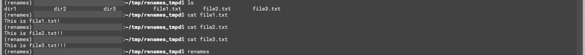
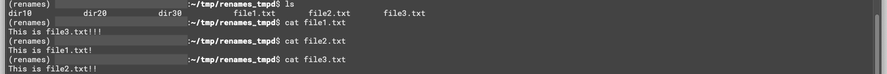

# renames

`renames` is a command line tool implemented with Python for Linux/MacOS.   
You can rename files on current directory at once.  

# Installation

You need Python >= 3.7.

## Basic
Clone this repo, go to `renames` directory where there is `seup.py`, and exec `$ pip install .`

## Use Pipenv
Pipfile and Pipfile.lock are on this repository.  
If you have installed `pipenv` already, you can install and use this tool soon without changing your local Python environment. If not, exec `$ pip install pipenv` to install `pipenv`.  

First, clone this repo in your arbitrary directory.  
Go to the `renames` directory, where there are Pipfile and Pipfile.lock, and type `$ pipenv install`.  
Virtual Python environment that contains this `renames` package in installed `pip` list is created.  
Exec `$ pipenv shell` and enter created virtaul environment.  
(See `renames` package is in `pip` list by `$ pip list` in virtual environment.)    
(You can exit virtual environment to type `$ exit` anywhere.)

All ready to try this tool!  
Go to a directory where there are many files you have to type `mv` again and again.
  

# Usage  
Exec `$ renames`, then your default editor is open (`renames` gets editor from `EDITOR` env variable. If not found, tries to open `vi`).  
File names on current directory will be displayed.  
Type destinate file names after `>>` and close editor with saving.  
Files are renamed at once ;)

## Example
Before:  

After:  

